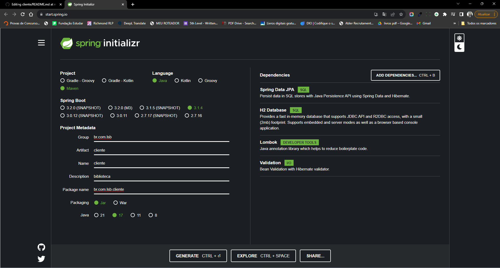

# Biblioteca

Este projeto consiste em criar um sistema de emprestimo de livros com a linguagem Java, utilizando JPA, DAO e o banco de dados H2.

O primeiro passo deste trabalho foi baixar os bibliotecas Spring Data JPA, Validation, H2 Database e Lombok, no link <https://start.spring.io/>.

Figura 1 - Start Spring.

Spring Framework e é usada para simplificar o desenvolvimento de aplicativos Java baseados em persistência de dados. Ela combina o Spring Data e o Java Persistence API (JPA) para fornecer uma maneira mais fácil e produtiva de acessar e manipular bancos de dados relacionais em aplicativos Java.

 Validation permite que seja definido e aplicados as regras de validação a objetos no aplicativo Java especifico. Ele é usado para garantir que os dados inseridos ou manipulados em seu aplicativo estejam em conformidade com regras específicas antes de serem processados.

 O H2 Database é um banco de dados relacional escrito em Java, projetado principalmente para desenvolvimento e testes. Ele é usado para criar bancos de dados temporários em memória ou armazenados em arquivos para depuração, teste e prototipagem.

Lombok é uma biblioteca que ajuda a reduzir a verbosidade do código Java, evitando a escrita repetitiva de getters, setters, construtores, e outros métodos comuns em classes.

Os tabelas foram criadas com com base no relacionamento apresnetado na imagem abaixo.

Figura 2 - Tabelas Aluno, Publicação e Emprestimo.

Dessa forma foi criado o arquivo data.sql, no qual cria todas as tabelas que estão sendo utilizadas no projeto, aluno, publicacao e emprestimo.

Figura 3 - Scrip de criação das tabelas em SQL no arquivo data.sql.

Posteriormente foi criado a classes com mapeamento em JPA para aluno, publicação e emprestimo (localizado no diretório entity). Foi criado também a classe DAO para aluno, publiação e emprestimo. Foi necessário criar a classe DAO para alunos e publicação, pois para realizar o emprestimo, deve ser realizado o cadastro o aluno e a publicação.

O exemplo de teste de funcionamento da classe DAO de emprestimo foi realizado no arquivo EmprestimoExampleController.java, neste exemplo foi realizado cadastro de 3 alunos, 3 livros e três emprestimos. Veja as figuras a seguir.

Figura 4 - Script da classe EmprestimoExampleController.

Veja o retorno dos dados salvas pelo arquivo EmprestimoExampleController no Postman na request Salvar_Tabela_Emprestimos. Resaltando, a collection está disponivel na pasta "collection_postman", com as devidas configurações.

Figura 5 - Retorno dos dados salvos pela classe EmprestimoExampleController no Postman.

Para ver o retorno no banco H2, deve ser acessado o link <http://localhost:8080/console-h2>. A figura 6 apresenta os retornos nas tabelas.

Figura 6 - Retorno das tabelas no H2.

Para lista  tabela no postman deve ser utilizada a request Consultar_Tabela_Emprestimos. Veja a figura a seguir.

Figura 7 - Retorno de todos os dados salvos na tabela Emprestimo.

A atualização de um emprestimo, deve utilizado o request Atualizar_Emprestimo_por_ID, e selecionar o id a ser atualizado, nesse casos o id 2 (http://localhost:8080/cliente/emprestimo/exemplo/atualizar/2),
no qual foi alterado a data de devolução com as seguintes informações:

{

    "dtemprestimo": "15/10/2023",
    
    "dtdevolucao": "16/10/2023"
    
}

A figura 8 apresenta detalhamente do que foi realizado.

Figura 8 - Atualização do emprestimo com id 2.

Para deletar um emprestimo deve ser utilizado a request Deletar_Emprestimo, nesse exemplo está deletando o id 3 (http://localhost:8080/cliente/emprestimo/exemplo/deletar/3).

Figura 9 - Consultar o emprestimo de id 3.

E por fim, para consultar um emprestimo por id deve ser utilizado a request Consultar_Emprestimo_por_ID, nesse exemplo está retornando o id 1 (http://localhost:8080/cliente/emprestimo/exemplo/consultar/1).

Figura 10 - Consulta do emprestimo de id 1.

